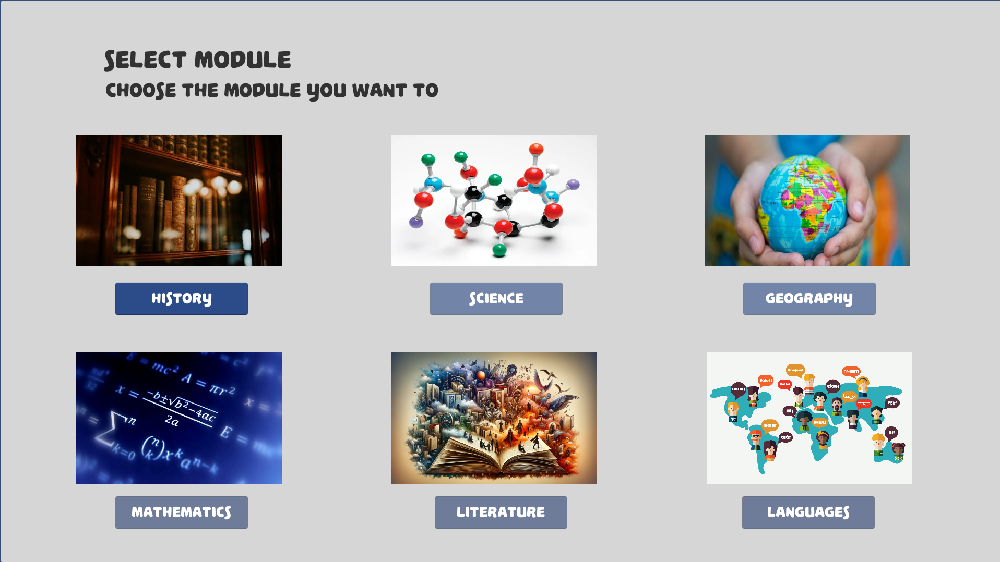
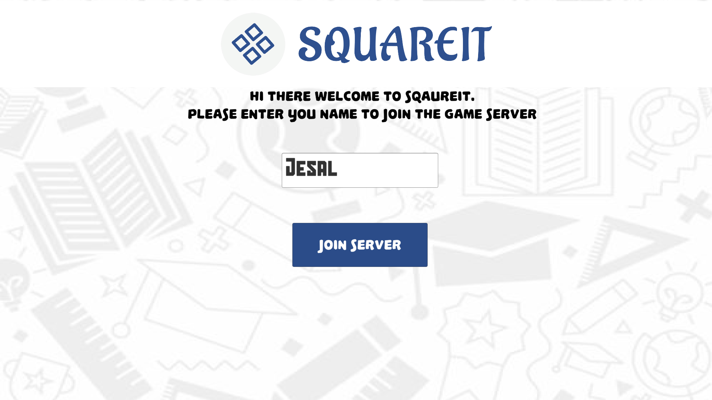
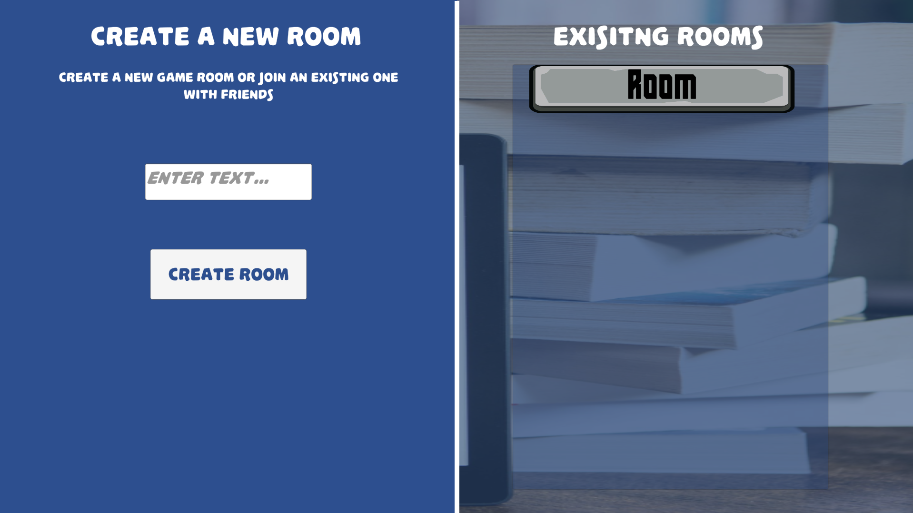
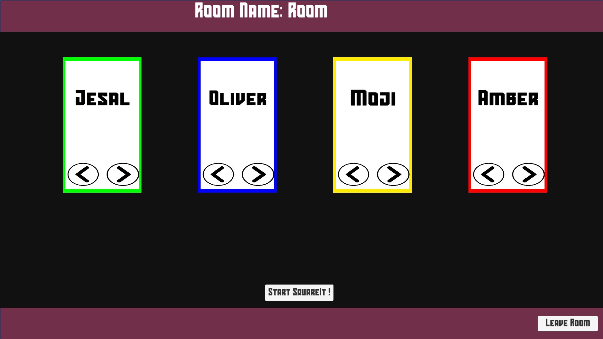
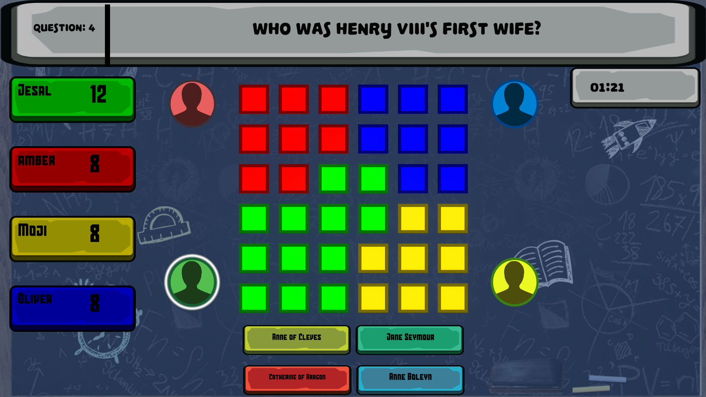
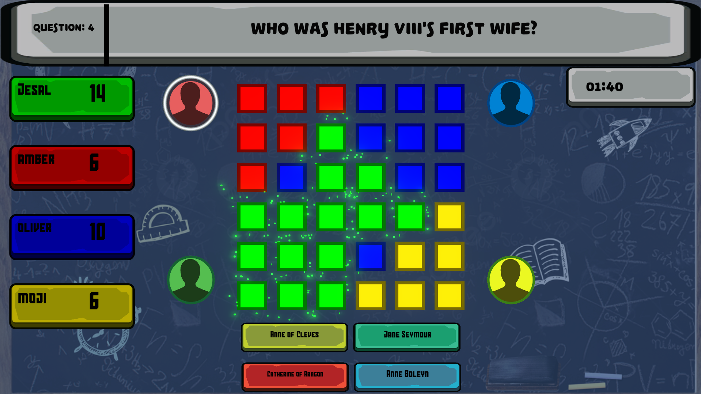
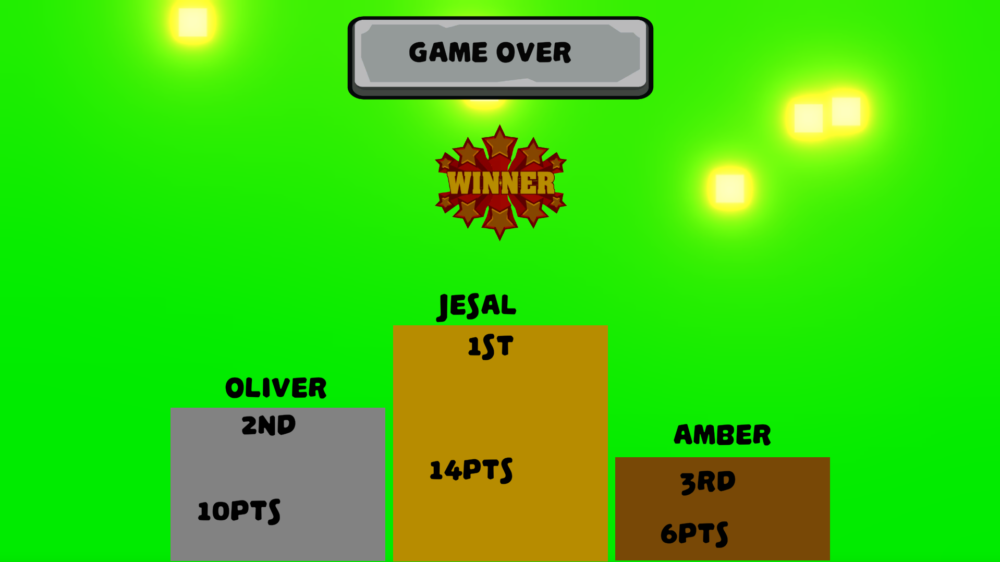

# SquareIt


SquareIt is an educational game designed for 11- to 14-year-olds that combines competitive gameplay with learning. Players can compete with friends, classmates, random opponents, or bots while answering curriculum-based questions. The goal is to gain territory on a grid by answering questions correctly and quickly.

## Table of Contents

- [Features](#features)
- [Gameplay](#gameplay)
- [Screenshots](#screenshots)
- [Requirements](#requirements)
- [Installation](#installation)
- [Contributing](#contributing)
- [License](#license)

## Features
### Bold marks completed features for prototype

- **User login system for students, teachers, and admins.**
- **Course selection.**
- **Access to lessons in text or video format.**
- **Question answering with immediate feedback.**
- **Randomised question order to prevent memorisation.**
- **2 Player and 4 Player multiplayer game modes.**
- **Leaderboard to display scores and achievements.**
- **Badges and trophies for completing levels.**
- **Support for screen readers and subtitles for accessibility.**
- **Multi-language support for inclusivity.**
- **Feedback instantly for continuous improvement.**

## Gameplay

1. **Login**: Players log in to their accounts.
2. **Course Selection**: Choose a course based on their curriculum.
3. **Game Start**: Once the educational content is acknowledged, players engage in the SquareIt game, where they answer questions in a timed setting.
4. **Scoring**: Players earn points for correct answers and can gain territory on the grid by answering questions quicker than their opponents.
5. **Winning**: The game ends when a player's section of the grid is fully colored in their color or the time runs out. Points are awarded based on speed and accuracy.

## Screenshots

### Select Course


### Enter Name


### Room Screen


### Colour Chooser


### Gameplay


### Streaks


### Game Over


## Requirements

### Completed Requirements

- **Course selector.**
- **Question answering system.**
- **Randomised question order.**
- **4 Player modes.**
- **Timer functionality.**
- **Scoring system.**
- **Server join functionality.**
- **Room creation for friends.**
- **Colour selector for gameplay.**
- **Leaderboard display.**
- **Feedback instantly for continuous improvement.**

### Incomplete Requirements
- User login system.
- Content creation (text and video access).
- Acknowledge button for educational content confirmation.
- Display of player names during gameplay.
- Virtual bot for unfilled player modes.
- Screen readers and subtitles for accessibility.
- Multi-language support for global usability.
- Badge collection system.
- Trophy room to display badges.
- 2 Player mode 

## Installation

To install SquareIt, clone this repository and open it in Unity 2021.3.32f1.

```bash
git clone https://github.com/jes4l/squareit.git
```

## Contributing

Contributions are welcome! Please open an issue or submit a pull request for any improvements or bug fixes.

## License

This project is licensed under the MIT License.


## Project Files
- [Documentation](documentation%2FREADME.md)
- [Prototype](prototypes)
- [Prototype Executable](prototypes%2FGroup%20Project.exe)

